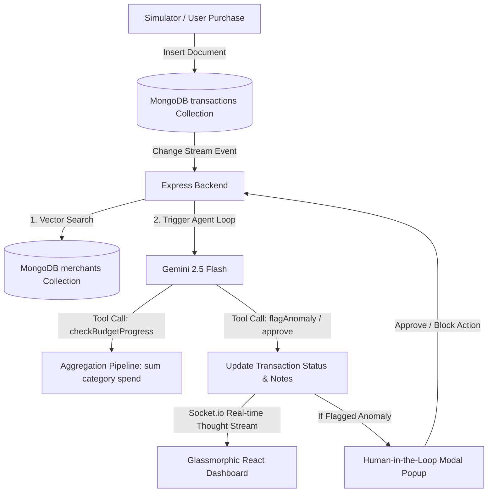

# 🪙 Penny: AI Personal Finance Agent

Penny is a real-time, AI-driven personal finance broker and transaction management system. Built for the **Google Cloud Rapid Agent Hackathon (MongoDB Track)**, it showcases how autonomous AI reasoning loops can be built directly on top of database events.

Penny monitors your transaction ledger in real-time using **MongoDB Change Streams**, parses incoming raw merchant text with **Atlas Vector Search**, checks monthly budget progress using **MongoDB Aggregations**, and makes intelligent routing decisions using **Google Gemini 2.5 Flash** with **Function Calling (Tool Use)** and **Human-in-the-Loop (HITL)** verification.

---

## 🛠️ Architecture & Tech Stack



### Backend
* **Runtime**: Node.js (ES Modules)
* **Framework**: Express.js
* **Database**: MongoDB Atlas (MongoClient Node Driver)
* **AI Engine**: Google Generative AI SDK (`gemini-2.5-flash` & `text-embedding-004`)
* **Real-time Push**: Socket.io

### Frontend
* **Runtime**: Vite + React + TypeScript
* **Styling**: Premium Vanilla CSS (Curated glassmorphism, responsive grid, visual animations)
* **Visuals**: Recharts (Custom gradient-filled bar charts), Lucide React (Sleek icons)
* **Real-time Pull**: Socket.io-client

---

## 🔑 Key Features & MongoDB Integrations

1. **MongoDB Change Streams (Real-Time Triggers)**
   * Every transaction inserted (e.g., via card swipes or simulator) immediately triggers a database change event. The backend listener captures the event and initiates Penny's reasoning loop in under 50ms.
2. **MongoDB Atlas Vector Search (Merchant Matching)**
   * Standardizes raw, messy transaction text (e.g. `Uber London Ride *4321`) to a canonical merchant (`Uber`) by converting descriptions into 768-dimension embeddings using Gemini's `text-embedding-004` and querying with `$vectorSearch`.
3. **MongoDB Aggregation Pipelines (Monthly Spend Analysis)**
   * Before approving, Penny executes an aggregation pipeline to group expenditures by category, checking if the new purchase will exceed the monthly budget limit.
4. **Autonomous Gemini Loop (Function Calling)**
   * Penny reasons step-by-step. It uses tools to query the database, approve transactions, or pause them for human intervention.
5. **Human-in-the-Loop (HITL) Guardrails**
   * If a transaction is high-risk (e.g. over $500), Penny flags it as an anomaly, halts approval, and triggers a real-time modal on the user's dashboard requesting verification.

---

## 🚀 Setup & Installation

### Prerequisites
* **Node.js** (v18+ recommended)
* **MongoDB Atlas Account** (M0 free tier or higher)
* **Google Gemini API Key** (Get free from [Google AI Studio](https://aistudio.google.com/))

### 1. MongoDB Atlas Configuration
Create a Vector Search index named **`vector_index`** on the **`merchants`** collection inside your database (e.g., `penny_db`):
1. Navigate to your Atlas Cluster -> **Search** -> **Create Search Index**.
2. Select **JSON Editor** under **Atlas Vector Search**.
3. Select your Database (`penny_db`) and Collection (`merchants`).
4. Paste the following index definition:
   ```json
   {
     "fields": [
       {
         "numDimensions": 768,
         "path": "embedding",
         "similarity": "cosine",
         "type": "vector"
       }
     ]
   }
   ```
5. Click **Next** and **Create Search Index**. Wait a few minutes for the index to build.

### 2. Environment Setup
Create a `.env` file in the `backend` directory (copied from `.env.example`):
```env
# MongoDB Connection URI (Atlas recommended)
MONGODB_URI=mongodb+srv://<username>:<password>@<cluster>.mongodb.net/penny_db?retryWrites=true&w=majority

# Gemini API Key
GEMINI_API_KEY=AIzaSy...

# Backend server port
PORT=5001
```

### 3. Install & Run Backend
In your terminal, navigate to the `backend` folder:
```bash
cd backend
npm install
npm run dev
```

### 4. Install & Run Frontend
Open a new terminal window and navigate to the `frontend` folder:
```bash
cd frontend
npm install
npm run dev
```
Open the provided local URL (usually `http://localhost:5173`) in your browser.

---

## 🎬 How to Demo Penny

1. **Reset & Seed Demo Data**: Click the **Reset & Seed Demo Data** button in the dashboard header. This seeds default category budgets, creates standard merchants (generating description embeddings), and loads recent transaction history.
2. **Standard Transaction Simulation**: Select the **Starbucks Coffee** ($6.80) or **Uber Ride** ($24.50) preset and click **Simulate Transaction**.
   * Observe the Change Stream capture it instantly.
   * Watch the **Live Agent Reasoning** terminal stream Penny's thought process step-by-step.
   * See the transaction added to the ledger as "Approved" with custom advice from Penny.
3. **Over-Budget Simulation**: Click the **Fly Emirates** ($350) preset.
   * Watch Penny run the aggregation pipeline, find that the "Travel" category limit will be exceeded, and approve it while appending a warnings alert on the dashboard.
4. **Anomalous Simulation (HITL)**: Click the **Apple Store** ($850) preset.
   * Because the amount exceeds the high-risk threshold ($500), Penny flags it as an anomaly.
   * A beautiful, warning-glow modal pops up on your screen asking whether you want to **Approve** or **Block**.
   * Select your choice, and watch the backend update the database and broadcast the status change instantly.

---

## 📜 License
This project is licensed under the MIT License - see the LICENSE file for details.
